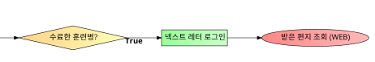

# 프로젝트 명
<!---->
<h1 align="center">💌 넥스트 레터</h1>

<!--   ravis CI, Circle CI, 또는 GitHub Action에서 제공하는 빌드 스테이터스 뱃지를 사용해 프로젝트가 정상적으로 돌아가고 있다는 안도감을 주자.
-   코드 커버리지, 코드 퀄리티, maintainability 뱃지를 사용해 프로젝트의 코드가 훌룡하고 안전하다는 인상을 주자.
-   npm 또는 pypi 등지에서 당신의 패키지가 얼마나 다운로드 되었는지를 표시하는 스탯이 어느정도 자랑할만 하다면 그 뱃지도 추가하자.
-   그 밖에 shields.io에서 원하는 뱃지를 찾아 붙여 보도록 하자.
-   다만 주의할 점은 과하지 않도록 해야 한다. -->

> 훈련병의 개인정보도 지켜주는 인편지기, 넥스트 레터  
> I'm on the, NEXT LETTER

## 프로젝트 소개
[인터넷 편지 현황]
- 육군 => 더캠프
- 해군 => 해군교육사령부
- 공군 => 공군 기본군사훈련단

[기존 인터넷 편지의 문제]
1. 주변에 친구한테 부탁해서 내 SNS 계정을 알려줘야하나요?
2. SNS에 내 개인정보를 업로드하기엔 불쾌한데..
3. 육군은 어플도 있는데, 해군/공군은 모바일에서  PC 버전으로 보는 건 불편해요.
4. 인편 작성하다가 자꾸 사라져요.
5. 훈련소 끝나고 나면 인터넷 편지를 다시 꺼내 볼 수 없어요.

[배경]
- 훈련소에서 훈련병들에게 유일하게 힘이되는 것이 "인터넷 편지"입니다.
- 기존의 인터넷 편지 어플리케이션인 "더캠프"와 "공군 기훈단"을 Legacy System으로 정의하고  
	새로운 기능을 추가하고 기존 기능을 개선하고자 합니다.
- 보다 안전하고 편한 인터넷 편지 발송 System을 통해 훈련병들에게 힘을 주고자 이번 프로젝트를 기획했습니다.


## 기능 설명

[핵심기술 : 웹 스크래핑 기술]  
	웹 스크래퍼가 우리 서비스의 핵심입니다.   
	기존의 인터넷 편지 시스템에 Request를 보내고 그에따른 Response를 받습니다.   
	
[주요 기능]
|  |육군 더캠프|해군 교육사|공군 기훈단|넥스트 레터|
|--|--|--|--|--|
|모바일 버전 제공|<center>⭕</center>|<center>❌</center>|<center>⭕</center>|<center>⭕</center>
|PC 버전 제공|<center>⭕</center>|<center>⭕</center>|<center>⭕</center>|<center>⭕</center>
|훈련 종료후 열람|<center>❌</center>|<center>❌</center>|<center>❌</center>|<center>⭕</center>
|개인 단축 URL 공유|<center>❌</center>|<center>❌</center>|<center>❌</center>|<center>⭕</center>
|개인정보 보호|<center>❌</center>|<center>❌</center>|<center>❌</center>|<center>⭕</center>
|익명 편지|<center>⭕</center>|<center>❌</center>|<center>⭕</center>|<center>⭕</center>
|발송 실패 시, 백업|<center>⭕</center>|<center>❌</center>|<center>❌</center>|<center>⭕</center>
- 주요 기능 ① : 모바일/PC 모두 쉽고 편하게  
	As-is : 불필요한 어플리케이션 설치, 모바일 환경 WEB의 부재  
	=> **To-be NextLetter : 반응형 WEB으로 구축**

- 주요 기능 ② : 훈련소에서 받은 고마움은 평생도록  
	As-is : 훈련소에서 프린트해 받은 인터넷 편지는 파손, 분실 후 복구 불가  
	=> **To-be NextLetter : 발송된 편지를 암호화된 DB에 저장, 사용자 인증 후 언제든지 열람**

- 주요 기능 ③ : 개인 Blog형 URL로 공유는 간편하게  
	As-is : 인터넷 편지 작성 방법을 서술해서 줄글로 공유  
	=> **To-Be NextLetter : 인터넷 편지 작성 할 수 있는 페이지의 단축 URL 을 공유**

- 주요 기능 ④ : 개인정보 보호를 우선으로  
	As-is : 군 입대전 친구에게 자신의 SNS 계정을 공유, 입대 후 생년월일/전화번호 등 개인정보를 공개 업로드  
	=> **To-be NextLetter : 인터넷 편지를 수신할 수 있는 URL을 입대전 개인 SNS에 게시**

- 주요 기능 ⑤ : 부가기능으로 더욱 확실하게 안전하게  
	익명 편지 발송 기능 추가  
	발송 실패 시, 백업 기능 추가


## 컴퓨터 구성 / 필수 조건 안내 (Prerequisites)
* ECMAScript 6 지원 브라우저 사용
* 권장: Google Chrome 버젼 77 이상

## 기술 스택 (Technique Used) 
### Server(back-end)
 - Java 1.8 버전 
 - Spring MVC Framework
 - MariaDB
 - Docker
 
### Front-end
- BootStrap
- HTML5
- CSS3

## 설치 안내 (Installation Process)
Project Download
```bash
$ git clone https://github.com/osamhack2021/WEB_NextLetter_SeaSky.git
```  
<br>

Using Web Project
1. Project Setting
2. Tomcat 8.0.53 (recommend version) Deploy

<br>

Using JAVA Module
1. SpringPRJ/src/poly/mail Package 내 .java File 
2. 육군 더캠프 => TheCampLibrary.java
	공군 기훈단 => AirForceLibrary.java
3. 하단의 프로젝트 사용법 참고

## 프로젝트 사용법 (Getting Started)

Work Flow  

- 입대전
<p align="center"></p>

- 입대 후 인터넷 편지 발송
<p align="center"></p>

- 수료 후 인터넷 편지 재조회
<p align="center"></p>

<details markdown="1">
<summary>육군 더캠프 라이브러리 (JAVA Code)</summary>

```java
/*
	TheCampLibrary.java
	육군 더캠프
*/
import poly.dto.CookieDTO;
import poly.dto.MessagesDTO;
import poly.dto.SoldierDTO;
import poly.dto.UserDTO;

import poly.mail.TheCampLibrary;

public static void main(String[] args){
	//더캠프 로그인
	UserDTO uDTO = new UserDTO();
	String thecamp_id="더캠프 아이디"; //더캠프 아이디
	uDTO.setThecamp_id(thecamp_id);
	String thecamp_pw="더캠프 암호"; //더캠프 암호
	uDTO.setThecamp_pw(thecamp_pw);
	
	//입대자 정보
	SoldierDTO sDTO = new SoldierDTO();
	String name="김땡땡"; //입대자 이름
	sDTO.setName(name);
	String birth="20010616"; //입대자 생년월일 8자리
	sDTO.setBirth(birth);
	String missSoldierClassCdNm="예비군인/훈련병"; //입대자 신분 (고정)
	sDTO.setMissSoldierClassCdNm(missSoldierClassCdNm);
	String grpCdNm="육군"; //군종 (고정)
	sDTO.setGrpCdNm(grpCdNm);
	String trainUnitCdNm="육군훈련소"; //입대 훈련소
	sDTO.setTrainUnitCdNm(trainUnitCdNm);
	String enterDate="20210913"; //입대일자 8자리
	sDTO.setEnterDate(enterDate);
	String missSoldierRelationship = "FRIEND"; //관계
	sDTO.setMissSoldierRelationship(missSoldierRelationship);

	//발송할 메시지
	String title = "라이브러리 테스트"; //편지 제목
	String content = "라이브러리 발송을 위한 테스트 중입니다. 이 내용을 폐기 하십시오. This is TheCamp Test."; //편지 내용
	
	MessageDTO mDTO = new MessageDTO();
	mDTO.setTitle(title);
	mDTO.setContent(content);

	try {
		String soldier_code = TheCampLibrary.getSoliderCode(uDTO, sDTO);
		String msg = TheCampLibrary.sendMsg(uDTO, sDTO, soldier_code, mDTO);//메시지 발송
	} catch (Exception e) {
		e.printStackTrace();
	}
}
```

</details>

<details markdown="1">
<summary>공군 기훈단 라이브러리 (JAVA Code)</summary>

```java
/*
	AirForceLibrary.java
	공군 기훈단
*/
import poly.dto.MessagesDTO;
import poly.dto.SoldierDTO;

import poly.mail.AirForceLibrary;

public static void main(String[] args){
	//입대자 정보
	SoldierDTO sDTO = new SoldierDTO();
	sDTO.setName("김땡땡"); //이름
	sDTO.setBirth("1999016"); //생년월일 8자리
	sDTO.setEnterDate("20210405"); //입대일 8자리

	MessageDTO mDTO = new MessageDTO();
	mDTO.setTitle("더캠프 테스트"); //편지 제목
	mDTO.setContent("더캠프 테스트 중입니다."); //편지 내용
	mDTO.setRelation("친구"); //관계
	mDTO.setPw("1234"); //편지 비밀번호 => 기훈단 홈페이지내 편지 조회 및 삭제
	
	String result = "";
	try {
		result = AirForceLibrary.sendMsg(sDTO, mDTO);
	} catch (Exception e) {
		e.printStackTrace();
	}
}
```

</details>
 
## 팀 정보 (Team Information)
- kim hyun ki (hkgo6040@naver.com), Github Id: Hyunki6040
- kim seong min (98kimsungmin@naver.com), Github Id: tolelom

## 저작권 및 사용권 정보 (Copyleft / End User License)
 * [MIT](https://github.com/osamhack2021/WEB_NextLetter_SeaSky/edit/master/readme.md)

This project is licensed under the terms of the MIT license.

<!--※ [라이선스 비교표(클릭)](https://olis.or.kr/license/compareGuide.do)

※ [Github 내 라이선스 키워드(클릭)](https://docs.github.com/en/github/creating-cloning-and-archiving-repositories/creating-a-repository-on-github/licensing-a-repository)

※ [\[참조\] Github license의 종류와 나에게 맞는 라이선스 선택하기(클릭)](https://flyingsquirrel.medium.com/github-license%EC%9D%98-%EC%A2%85%EB%A5%98%EC%99%80-%EB%82%98%EC%97%90%EA%B2%8C-%EB%A7%9E%EB%8A%94-%EB%9D%BC%EC%9D%B4%EC%84%A0%EC%8A%A4-%EC%84%A0%ED%83%9D%ED%95%98%EA%B8%B0-ae29925e8ff4)-->
